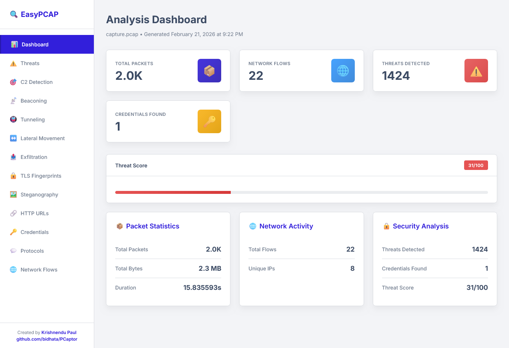

# 🔍 PCaptor

<div align="center">


[](https://github.com/bidhata/PCaptor/issues)
[](https://github.com/bidhata/PCaptor/stargazers)

**Enterprise-Grade Network Packet Analyzer with Advanced Threat Detection**

[Features](#-features) • [Installation](#-installation) • [Usage](#-usage) • [Documentation](#-documentation) • [Contributing](#-contributing)

</div>

---

## 📋 Overview

PCaptor is a high-performance network packet analyzer built in Go that provides comprehensive threat detection, C2 framework identification, and protocol analysis. Designed for CTF challenges, Red Team operations, Threat Hunting, and security professionals. Inspired by [CAPLOADER](https://www.netresec.com/?page=CapLoader)

**Version 2.0** introduces advanced detection capabilities:
- 🎯 Beaconing Detection (statistical C2 callback analysis)
- 🔒 TLS Fingerprinting (JA3/JA4 for encrypted C2)
- 🚇 Tunneling Detection (SSH, ICMP, DNS, SOCKS)
- ↔️ Lateral Movement Detection (multi-protocol)
- 📤 Data Exfiltration Detection (large uploads)
- 🖼️ Steganography Detection (hidden data in files)
- 💰 Cryptocurrency Mining Detection
- 🔐 Anonymization Detection (Tor, VPN, proxies)
- 📊 Payload Entropy Analysis

## 📸 Screenshots

### Dashboard Overview
<div align="center">
  
  <p><em>Interactive dashboard with statistics, threat score, and summary cards</em></p>
</div>

### Why PCaptor?

- 🚀 **High Performance**: Process 75,000+ packets per second ( though detection takes time )
- 🎯 **Advanced C2 Detection**: Identify 11 major C2 frameworks
- 🧠 **Behavioral Analysis**: Detect unknown threats through pattern analysis
- 🌐 **DNS Tunneling Detection**: Identify data exfiltration via DNS
- 📊 **Professional Reports**: Interactive HTML dashboards with CoreUI styling
- 💾 **SIEM Ready**: Export to CSV/JSON for integration
- 🔧 **Zero Dependencies**: Single binary, no installation required

---

## ✨ Features

### 🎯 Core Capabilities

PCaptor provides enterprise-grade network analysis with 10 advanced detection engines:

1. **C2 Framework Detection** - 11 major frameworks with 40+ signatures
2. **Beaconing Detection** - Statistical timing analysis for C2 callbacks
3. **TLS Fingerprinting** - JA3/JA4 hash analysis for encrypted traffic
4. **Tunneling Detection** - SSH, ICMP, DNS, SOCKS tunneling identification
5. **Lateral Movement** - Multi-protocol lateral movement detection
6. **Data Exfiltration** - Large upload and suspicious transfer detection
7. **Steganography Detection** - Hidden data in images and files
8. **Crypto Mining Detection** - Mining pool and Stratum protocol detection
9. **Anonymization Detection** - Tor, VPN, and proxy identification
10. **Payload Entropy Analysis** - Encrypted/packed payload detection

### 🎯 C2 Framework Detection (11 Frameworks)

Detect and identify Command & Control communications from major frameworks:

| Framework | Detection Method | Confidence |
|-----------|-----------------|------------|
| **Cobalt Strike** | 40+ URI patterns, Malleable C2, checksum8 | High |
| **Metasploit** | Meterpreter signatures, payload checksums | High |
| **PowerShell Empire** | Default endpoints, User-Agent patterns | High |
| **Covenant** | Framework-specific URIs | Medium |
| **Sliver** | High entropy URIs, stager patterns | Medium |
| **Mythic** | API endpoints, callback URIs | High |
| **Brute Ratel C4** | Badger User-Agent, URI patterns | High |
| **PoshC2** | Implant URIs, User-Agent detection | Medium-High |
| **Havoc** | Demon agent patterns | Medium |
| **Pupy RAT** | Connection patterns, User-Agent | High |
| **Koadic** | Stage/stager patterns | Medium |

### 🧠 Advanced Detection Methods

#### 1. Signature-Based Detection
- Framework-specific URI patterns
- User-Agent fingerprinting
- Known tool signatures
- Payload pattern matching
- JA3/JA4 TLS fingerprinting

#### 2. Behavioral Analysis
- Non-browser User-Agent detection (python-requests, curl, wget, PowerShell)
- High entropy URI analysis (>60% unique characters)
- Direct IP communication detection
- Non-standard port identification (4444, 8080, 8443, etc.)
- Suspicious script parameter detection
- Payload entropy analysis (encrypted/packed data)

#### 3. Beaconing Detection (Statistical C2 Callback Analysis)
- **Statistical Timing Analysis**: Analyzes packet intervals for regular patterns
- **Jitter Calculation**: Coefficient of variation (CV) to measure timing consistency
  - CV < 0.15: High confidence beaconing (very regular intervals)
  - CV < 0.30: Medium confidence beaconing (moderately regular)
  - CV < 0.50: Low confidence beaconing (somewhat regular)
- **Minimum Requirements**: 10+ packets for statistical significance
- **Interval Range**: Detects beacons from 1 second to 1 hour intervals
- **Use Cases**: Identifies C2 heartbeats, periodic callbacks, automated check-ins
- **Output**: Interval duration, jitter score, packet count, time range, total bytes

#### 4. Tunneling Detection (4 Tunnel Types)
- **SSH Tunneling Detection**:
  - High throughput analysis (>100KB/s)
  - Packet rate monitoring (>50 packets/s)
  - Long-lived connection detection (>5 minutes)
  - Identifies port forwarding and SOCKS proxies
- **ICMP Tunneling Detection**:
  - Large payload analysis (>100 bytes)
  - High entropy detection (>0.8)
  - Unusual ICMP traffic patterns
  - Detects tools like ptunnel, icmptunnel
- **DNS Tunneling Detection** (5 methods):
  - Long subdomain analysis (>50 characters)
  - High entropy subdomain detection (>0.7)
  - Excessive subdomain levels (>5 levels)
  - Known tool signatures (dnscat, iodine, dns2tcp, tuns, ozymandns)
  - Base32/Base64 encoded data detection
- **SOCKS Proxy Detection**:
  - SOCKS4/5 handshake identification
  - Protocol version detection (0x04, 0x05)
  - Connection method analysis

#### 5. Lateral Movement Detection (8 Protocols)
- **SMB Lateral Movement** (Port 445):
  - PsExec detection
  - WMI remote execution
  - DCOM lateral movement
  - File share access patterns
- **RDP Lateral Movement** (Port 3389):
  - Remote desktop connections
  - Multiple target detection
- **SSH Lateral Movement** (Port 22):
  - SSH connection patterns
  - Key-based authentication
- **WinRM Lateral Movement** (Ports 5985/5986):
  - PowerShell remoting
  - HTTP/HTTPS WinRM
- **RPC/DCOM** (Port 135):
  - Remote procedure calls
  - Distributed COM
- **Database Lateral Movement**:
  - MSSQL (Port 1433)
  - MySQL (Port 3306)
  - PostgreSQL (Port 5432)
- **Multi-Target Pattern Recognition**: Detects single source connecting to multiple targets
- **Confidence Scoring**: Based on protocol, port, and connection patterns

#### 6. Data Exfiltration Detection (7 Methods)
- **Upload Rate Analysis**: Detects sustained uploads >50KB/s
- **Protocol-Specific Detection**:
  - **HTTP POST** (Port 80): High confidence exfiltration
  - **HTTPS** (Port 443): Encrypted exfiltration
  - **FTP Upload** (Port 21): File transfer exfiltration
  - **SSH/SCP** (Port 22): Secure copy exfiltration
  - **DNS Tunneling** (Port 53): DNS-based exfiltration
  - **SMTP Email** (Ports 25, 587): Email attachment exfiltration
  - **SMB File Transfer** (Port 445): Network share exfiltration
- **Volume Analysis**: Enhanced confidence for transfers >10MB
- **Duration Tracking**: Monitors sustained transfer periods
- **Rate Calculation**: Bytes per second analysis
- **Output**: Transfer method, volume, rate, duration, confidence level

#### 7. TLS/SSL Analysis
- JA3 fingerprinting for encrypted C2
- Known malicious JA3 hash database
- TLS version detection
- Server Name Indication (SNI) extraction
- Suspicious TLS pattern identification

#### 8. Steganography Detection (5 Techniques)
- **LSB Entropy Analysis**: Detects Least Significant Bit manipulation
  - Analyzes LSB plane entropy
  - Compares with full image entropy
  - Threshold-based detection (>0.4 difference)
- **Known Tool Signatures** (10+ tools):
  - Steghide, OutGuess, JPHide, JPSeek
  - F5, OpenStego, StegFS, Camouflage
  - OpenPuff, SilentEye
- **File Type Detection**: Magic byte analysis
  - PNG, JPEG, BMP, GIF images
  - Automatic format identification
- **Metadata Analysis**: Comment and metadata entropy
  - High entropy in comments indicates hidden data
  - Threshold: >0.7 entropy
- **Payload Extraction**: Extracts suspicious files for analysis
- **Confidence Scoring**: Based on multiple indicators

#### 9. Cryptocurrency Mining Detection (3 Methods)
- **Mining Pool Detection** (50+ pools):
  - Major pools: Nanopool, Ethermine, F2Pool, Antpool
  - Monero pools: SupportXMR, MineXMR, XMRPool
  - Multi-coin pools: NiceHash, MiningPoolHub
  - Regional pools: ViaBTC, BTC.com, Poolin
- **Stratum Protocol Detection**:
  - Mining protocol handshake identification
  - JSON-RPC method detection (mining.subscribe, mining.authorize)
  - Stratum message pattern matching
- **Mining Software Signatures** (10+ tools):
  - XMRig, Claymore, PhoenixMiner, T-Rex
  - NBMiner, GMiner, lolMiner, Bminer
  - CCMiner, CGMiner
- **Common Mining Ports**:
  - 3333, 4444, 5555, 8888, 9999
  - 14444, 45560 (Monero-specific)
- **Confidence Scoring**: Based on pool, protocol, and port detection

#### 10. Anonymization Detection (4 Categories)
- **Tor Network Detection**:
  - Tor relay port (9001)
  - Tor directory port (9030)
  - Tor SOCKS proxy (9050, 9150)
  - Tor control port (9051)
  - .onion domain detection (hidden services)
- **VPN Protocol Detection** (5 protocols):
  - OpenVPN (Port 1194)
  - PPTP VPN (Port 1723)
  - IPSec VPN/IKE (Port 500)
  - IPSec NAT-T (Port 4500)
  - L2TP VPN (Port 1701)
- **VPN Provider Detection** (15+ providers):
  - NordVPN, ExpressVPN, ProtonVPN
  - Mullvad, Private Internet Access (PIA)
  - CyberGhost, Surfshark, IPVanish
  - TunnelBear, Windscribe, VyprVPN
  - TorGuard, PureVPN, HideMyAss
- **Proxy Detection**:
  - SOCKS4/5 handshake detection
  - Proxy keywords in hostnames
  - ProxyChains detection
- **Severity Levels**:
  - High: Tor hidden services (.onion)
  - Medium: Tor network connections
  - Low: VPN/Proxy usage

#### 11. Payload Entropy Analysis (Encryption/Packing Detection)
- **Shannon Entropy Calculation**: 0-1 normalized entropy score
- **Threshold-Based Detection**:
  - Entropy > 0.95: High confidence encrypted/packed (medium severity)
  - Entropy > 0.92: Medium confidence encrypted/packed
  - Entropy > 0.90: Low confidence encrypted/packed (low severity)
- **Minimum Payload Size**: 100 bytes for statistical significance
- **Use Cases**:
  - Encrypted C2 payloads
  - Packed malware
  - Obfuscated data
  - Compressed transfers
- **Frequency Analysis**: Byte distribution analysis
- **Output**: Entropy score, confidence level, flow information

#### 12. Generic Pattern Matching
- Suspicious keywords (/c2/, /command, /backdoor, /rat)
- Base64 encoding detection (>80% match)
- URL encoding detection (>5 percent signs)
- UUID pattern identification

### 🌐 Protocol Analysis (12 Protocols)

| Protocol | Capability |
|----------|-----------|
| **HTTP/HTTPS** | URL extraction, C2 detection, User-Agent analysis, POST data |
| **FTP** | Credential extraction, command logging, file transfers |
| **Telnet** | Credential extraction, session analysis, command logging |
| **SMTP/POP3/IMAP** | Email credential extraction, sender/recipient tracking |
| **DNS** | Query analysis, tunneling detection, subdomain entropy |
| **IRC** | Chat message extraction, channel tracking, user identification |
| **SNMP** | Network management message analysis, community strings |
| **LDAP** | Directory service query extraction, authentication attempts |
| **SIP** | VoIP signaling analysis, call setup/teardown |
| **XMPP** | Instant messaging extraction, presence information |
| **TFTP** | File transfer tracking, filename extraction |
| **Syslog** | System log analysis, severity levels, facility codes |

### 🔐 Security Analysis Features

- **Credential Extraction**: Automatic extraction from cleartext protocols (FTP, Telnet, SMTP, POP3, IMAP, LDAP)
- **Password Strength Analysis**: Scoring algorithm for extracted passwords (weak/medium/strong)
- **Threat Detection**: Anomaly detection with severity scoring (high/medium/low)
- **IOC Extraction**: Automatic extraction of indicators of compromise (IPs, domains, URLs)
- **File Extraction**: Extract files from network traffic (HTTP, FTP, TFTP)
- **Certificate Analysis**: SSL/TLS certificate extraction and validation
- **Port Scan Detection**: Identifies reconnaissance activity (>20 ports scanned)
- **Large Transfer Detection**: Monitors data transfers >10MB
- **Behavioral Analysis**: Pattern-based threat detection
- **Multi-Layer Detection**: Combines signature, behavioral, and statistical methods

### 📊 Professional Reporting Features

#### HTML Report (Interactive Dashboard)
- **CoreUI Professional Styling**: Modern, responsive interface
- **Sidebar Navigation**: Quick access to all sections
- **Searchable Tables**: Real-time filtering across all data
- **Color-Coded Badges**: Visual confidence indicators
  - 🔴 Red: High confidence/severity
  - 🟡 Yellow: Medium confidence/severity
  - 🔵 Blue: Low confidence/severity
- **Dashboard Sections**:
  - Overview Statistics (packets, flows, protocols, threats)
  - Threat Score (0-100 risk assessment)
  - Summary Cards (C2 detections, credentials, beaconing)
  - Threats (All security issues)
  - C2 Detection (Framework identification)
  - Beaconing Patterns (Statistical analysis)
  - TLS Fingerprints (JA3/JA4 hashes)
  - SSH Tunnels (Tunneling detection)
  - Lateral Movement (Multi-protocol patterns)
  - Data Exfiltration (Large uploads)
  - HTTP URLs (All accessed URLs)
  - Credentials (Extracted credentials with strength)
  - Protocol Messages (IRC, SNMP, LDAP, SIP, XMPP, TFTP, Syslog)
  - Network Flows (Top connections)

#### CSV Export (SIEM Ready)
15 CSV files for comprehensive analysis:
- `threats.csv` - All detected threats with severity
- `c2_detections.csv` - C2 framework detections with confidence
- `beaconing.csv` - Beaconing pattern analysis with jitter
- `tls_fingerprints.csv` - JA3/JA4 TLS fingerprints
- `ssh_tunnels.csv` - SSH tunneling detections
- `lateral_movement.csv` - Lateral movement patterns
- `exfiltration.csv` - Data exfiltration detections
- `http_urls.csv` - HTTP URL access log
- `credentials.csv` - Extracted credentials with strength
- `irc_chat.csv` - IRC messages with channels
- `snmp.csv` - SNMP messages with OIDs
- `ldap.csv` - LDAP queries with filters
- `sip.csv` - SIP messages with call info
- `xmpp.csv` - XMPP messages with JIDs
- `tftp.csv` - TFTP transfers with filenames
- `syslog.csv` - Syslog messages with severity

#### JSON Export (Automation Ready)
- Complete structured data export
- API integration ready
- All metadata included
- Nested object support
- Timestamp preservation
- Flow statistics included

### 🚀 Performance & Optimization

- **High-Speed Processing**: 75,000+ packets per second
- **Worker Pool Architecture**: Configurable concurrent processing (default: CPU count)
- **Memory Management**: Smart limits prevent exhaustion (capped at 8GB)
- **Single-Pass Processing**: Efficient PCAP reading without re-parsing
- **Flow Tracking**: Handles up to 1,000,000 flows
- **Message Limits**: 100,000 messages per protocol to prevent memory bloat
- **Optimized Statistics**: Fast calculation algorithms with min-heap selection
- **Timestamp Sampling**: Limited sampling to prevent memory exhaustion
- **Large File Support**: Handles PCAP files up to 5GB+
- **Zero Dependencies**: Single binary, no external libraries required

### 🛠️ Professional Features

- **Structured Logging**: DEBUG, INFO, WARN, ERROR levels with timestamps
- **Configuration File Support**: JSON-based configuration (pcaptor.json)
- **Standardized Exit Codes**: 7 exit codes for automation
  - 0: Success
  - 1: General error
  - 2: Invalid arguments
  - 3: File not found
  - 4: Permission denied
  - 5: Invalid file format
  - 6: Processing error
- **Graceful Shutdown**: SIGINT/SIGTERM handling with cleanup
- **Enhanced Error Handling**: File validation, permission checks, format detection
- **Professional CLI**: Organized help, clear options, version management
- **Build Information**: Comprehensive version, build time, Go version, platform

---

## 🚀 Installation

### Download Pre-Built Binaries

#### Windows (64-bit)
```bash
# Download pcaptor-windows-amd64.exe
# No installation required - just run!
```

#### Linux (64-bit)
```bash
# Download pcaptor-linux-amd64
chmod +x pcaptor-linux-amd64
./pcaptor-linux-amd64 -version
```

### Build from Source

#### Prerequisites
- Go 1.20 or higher
- Git

#### Clone and Build
```bash
git clone https://github.com/bidhata/PCaptor.git
cd PCaptor
go build -o pcaptor
```

#### Cross-Compilation
```bash
# Windows 64-bit
GOOS=windows GOARCH=amd64 go build -o pcaptor-windows-amd64.exe

# Linux 64-bit
GOOS=linux GOARCH=amd64 go build -o pcaptor-linux-amd64

# macOS 64-bit
GOOS=darwin GOARCH=amd64 go build -o pcaptor-darwin-amd64
```

---

## 💻 Usage

### Basic Commands

```bash
# Generate HTML report
./pcaptor -f capture.pcap -html

# Generate all report formats
./pcaptor -f capture.pcap -html -csv -json

# Specify output directory
./pcaptor -f capture.pcap -o /path/to/output -html

# Adjust worker count for performance
./pcaptor -f capture.pcap -w 16 -html

# Show version information
./pcaptor -version
```

### Command-Line Options

| Option | Description | Default |
|--------|-------------|---------|
| `-f` | PCAP/PCAPNG file to analyze (required) | - |
| `-o` | Output directory for reports | `<pcap_name>_extracted` |
| `-w` | Number of worker goroutines | CPU count |
| `-html` | Export HTML report | false |
| `-json` | Export JSON report | false |
| `-csv` | Export CSV reports | false |
| `-version` | Show version information | - |

### Supported File Formats

- **PCAP** (.pcap) - Standard packet capture format
- **PCAPNG** (.pcapng) - Next generation packet capture format

Both formats are automatically detected and processed.

---

## 📖 Examples

### Example 1: Quick Analysis
```bash
# Analyze a PCAP file and generate HTML report
./pcaptor -f suspicious_traffic.pcap -html

# Output:
# - suspicious_traffic_report.html
# - suspicious_traffic_extracted/ (directory with extracted files)
```

### Example 2: Complete Analysis
```bash
# Generate all report formats
./pcaptor -f network_capture.pcap -html -csv -json

# Output:
# - network_capture_report.html
# - network_capture_report.json
# - network_capture_threats.csv
# - network_capture_c2_detections.csv
# - network_capture_http_urls.csv
# - network_capture_credentials.csv
# - ... (additional CSV files)
```

### Example 3: Large File Analysis
```bash
# Process large PCAP with custom worker count
./pcaptor -f large_capture.pcap -w 32 -html -csv

# Optimized for:
# - Files up to 5GB+
# - Memory capped at 8GB
# - 1M flow limit
# - 100K message limit per protocol
```

### Example 4: SIEM Integration
```bash
# Export for Splunk
./pcaptor -f capture.pcap -csv
splunk add oneshot capture_c2_detections.csv -sourcetype csv

# Export for ELK Stack
./pcaptor -f capture.pcap -json
curl -X POST "localhost:9200/c2/_doc" \
  -H 'Content-Type: application/json' \
  -d @capture_report.json
```

### Example 5: Automated Analysis
```python
#!/usr/bin/env python3
import subprocess
import json

# Run PCaptor
subprocess.run(['./pcaptor', '-f', 'capture.pcap', '-json'])

# Parse results
with open('capture_report.json') as f:
    data = json.load(f)

# Alert on high-confidence C2 detections
for detection in data['c2_detections']:
    if detection['confidence'] == 'high':
        print(f"🚨 ALERT: {detection['framework']} detected!")
        print(f"   URL: {detection['url']}")
        print(f"   Source: {detection['SrcIP']}")
        print(f"   Destination: {detection['DstIP']}")
```

---

## 📊 Performance

### Benchmarks

| Metric | Value |
|--------|-------|
| **Processing Speed** | 75,000 packets/second |
| **Memory Usage** | Capped at 8GB for large files |
| **Flow Limit** | 1,000,000 flows maximum |
| **Message Limit** | 100,000 per protocol |
| **Concurrent Workers** | Configurable (default: CPU count) |

### Test Results

```
Test File: capture.pcap (340 MB)
├── Packets: 506,832
├── Processing Time: 6.8 seconds
├── Throughput: 74,500 packets/second
├── Flows Tracked: 331,442
├── C2 Detections: 10,997
├── Threats Detected: 3,848
├── Memory Usage: <2GB
└── Status: ✅ Success
```

### Optimization Features

- **Worker Pool Architecture**: Concurrent packet processing
- **Memory Management**: Smart limits prevent exhaustion
- **Single-Pass Processing**: Efficient PCAP reading
- **Optimized Statistics**: Fast calculation algorithms
- **Min-Heap Selection**: Efficient top-N flow selection
- **Timestamp Sampling**: Limited to prevent memory bloat

---

## 🎯 Use Cases

### 1. Incident Response
- **Rapid C2 Identification**: Quickly identify active C2 channels
- **IOC Extraction**: Automatic extraction for blocking
- **Timeline Reconstruction**: Timestamp-based analysis
- **Framework Attribution**: Know which tools attackers used

### 2. Threat Hunting
- **Proactive Detection**: Find C2 before it's actively used
- **Behavioral Patterns**: Identify unknown C2 tools
- **DNS Tunneling**: Catch data exfiltration attempts
- **Anomaly Detection**: Behavioral analysis of traffic

### 3. Forensic Analysis
- **Post-Breach Investigation**: Understand attack timeline
- **Communication Patterns**: Analyze C2 behavior
- **Data Exfiltration**: DNS tunneling detection
- **Credential Compromise**: Identify stolen credentials

### 4. Security Monitoring
- **Real-Time Analysis**: Process live captures
- **SIEM Integration**: CSV/JSON export for log ingestion
- **Alert Generation**: High-confidence detection alerts
- **IOC Collection**: Automatic indicator extraction

### 5. Network Analysis
- **Protocol Distribution**: Understand network composition
- **Flow Analysis**: Top talkers and connections
- **Bandwidth Usage**: Traffic volume analysis
- **Service Identification**: Protocol detection

---

## 🔧 Integration

### SIEM Platforms

#### Splunk
```bash
./pcaptor -f capture.pcap -csv
splunk add oneshot capture_c2_detections.csv -sourcetype csv
```

#### ELK Stack
```bash
./pcaptor -f capture.pcap -json
logstash -f pcaptor-logstash.conf
```

#### QRadar
```bash
./pcaptor -f capture.pcap -csv
# Import CSV files into QRadar log sources
```

### Automation Scripts

#### Bash
```bash
#!/bin/bash
for pcap in /captures/*.pcap; do
    ./pcaptor -f "$pcap" -html -csv -json
done
```

#### Python
```python
import os
import subprocess

pcap_dir = '/captures'
for file in os.listdir(pcap_dir):
    if file.endswith('.pcap'):
        subprocess.run(['./pcaptor', '-f', 
                       os.path.join(pcap_dir, file), 
                       '-html', '-csv'])
```

### API Integration

```python
import json
import requests

# Run analysis
subprocess.run(['./pcaptor', '-f', 'capture.pcap', '-json'])

# Load results
with open('capture_report.json') as f:
    data = json.load(f)

# Send to API
for detection in data['c2_detections']:
    if detection['confidence'] == 'high':
        requests.post('https://api.example.com/alerts', 
                     json=detection)
```

---

## 📚 Documentation

### Quick Reference

- **[C2 Detection Guide](C2_DETECTION.md)** - Comprehensive C2 detection documentation
- **[Quick Reference](C2_QUICK_REFERENCE.md)** - Command cheat sheet and patterns

### Confidence Levels

| Level | Badge | Criteria | Action |
|-------|-------|----------|--------|
| **High** | 🔴 Red | Multiple indicators, known signatures | Investigate immediately |
| **Medium** | 🟡 Yellow | Single strong indicator, entropy patterns | Review and analyze |
| **Low** | 🔵 Blue | Generic patterns, behavioral anomalies | Monitor and correlate |

### Output Structure

```
<pcap_name>_extracted/
├── files/                    # Extracted files from traffic
├── certificates/             # SSL/TLS certificates
├── <pcap_name>_report.html  # Interactive HTML report
├── <pcap_name>_report.json  # Complete JSON data
├── <pcap_name>_threats.csv  # All threats
├── <pcap_name>_c2_detections.csv
├── <pcap_name>_http_urls.csv
├── <pcap_name>_credentials.csv
└── ... (additional CSV files)
```

---

## 🏗️ Architecture

### System Design

```
┌─────────────────────────────────────────────────────────┐
│                     PCaptor Core                         │
├─────────────────────────────────────────────────────────┤
│                                                          │
│  ┌──────────────┐      ┌──────────────┐               │
│  │ PCAP Reader  │─────▶│ Worker Pool  │               │
│  └──────────────┘      └──────┬───────┘               │
│                               │                         │
│                               ▼                         │
│  ┌────────────────────────────────────────┐            │
│  │        Packet Processors                │            │
│  ├────────────────────────────────────────┤            │
│  │ • Protocol Parsers                     │            │
│  │ • C2 Detection Engine                  │            │
│  │ • Behavioral Analyzer                  │            │
│  │ • DNS Tunneling Detector               │            │
│  │ • Credential Extractor                 │            │
│  │ • Flow Tracker                         │            │
│  └────────────┬───────────────────────────┘            │
│               │                                         │
│               ▼                                         │
│  ┌────────────────────────────────────────┐            │
│  │        Report Generators                │            │
│  ├────────────────────────────────────────┤            │
│  │ • HTML (CoreUI Dashboard)              │            │
│  │ • CSV (SIEM Ready)                     │            │
│  │ • JSON (API Ready)                     │            │
│  └────────────────────────────────────────┘            │
│                                                          │
└─────────────────────────────────────────────────────────┘
```

### Key Components

1. **PCAP Reader**: Efficient single-pass file reading
2. **Worker Pool**: Concurrent packet processing (configurable workers)
3. **Protocol Parsers**: 11 protocol analyzers
4. **C2 Detection Engine**: 11 framework detectors + behavioral analysis
5. **Flow Tracker**: Network flow management with memory limits
6. **Report Generators**: HTML, CSV, JSON exporters

---

## ⚠️ Limitations

- **Signature-Based Detection**: Can be evaded with custom C2 profiles
- **Encrypted Traffic**: HTTPS limits deep packet inspection
- **False Positives**: Behavioral analysis may flag legitimate traffic
- **Heuristic-Based**: DNS tunneling detection uses pattern matching
- **Memory Limits**: Large captures capped at 8GB memory usage

### Mitigation Strategies

1. **Multiple Detection Methods**: Combine signature + behavioral + DNS
2. **Confidence Scoring**: Prioritize high-confidence detections
3. **Context Analysis**: Review full packet context
4. **Continuous Updates**: Regular signature updates
5. **Manual Review**: Verify high-impact findings

---

## 🛣️ Planned Pro Version ( Paid )

### Planned Features

- Machine learning-based C2 detection ( Research ongoing )
- ✨ JA3/JA4 TLS fingerprinting
- ✨ Network flow temporal analysis
- ✨ Custom signature support
- ✨ YARA rule integration
- ✨ Free Threat intelligence feed integration
- ✨ VirusTotal and URLhaus API integration for IOC verification
- ✨ Real-time capture analysis ( Upcoming )
- ✨ Web-based GUI ( Do we need it ? Really ? )
- ✨ Plugin Based architecture

---

## 🤝 Contributing

Contributions are welcome! Please see [CONTRIBUTING.md](CONTRIBUTING.md) for guidelines.

### Quick Start

1. Fork the repository
2. Create a feature branch (`git checkout -b feature/amazing-feature`)
3. Commit your changes (`git commit -m 'Add amazing feature'`)
4. Push to the branch (`git push origin feature/amazing-feature`)
5. Open a Pull Request

### Development

```bash
git clone https://github.com/bidhata/PCaptor.git
cd PCaptor
go mod download
go build
```

---

## 📄 License

This project is licensed under the MIT License - see the [LICENSE](LICENSE) file for details.

---

## 👤 Author

**Krishnendu Paul** (@bidhata)

- 🌐 Website: [https://krishnendu.com](https://krishnendu.com)
- 💻 GitHub: [@bidhata](https://github.com/bidhata)
- 📧 Email: contact@krishnendu.com

---

## 🙏 Acknowledgments

- **MITRE ATT&CK Framework** - Threat intelligence and C2 framework analysis
- **gopacket Library** - Packet processing capabilities
- **CoreUI** - Professional HTML report styling
- **Security Research Community** - C2 framework signatures and patterns

---

## 📞 Support

### Getting Help

- 📖 **Documentation**: Check the docs in this repository
- 🐛 **Bug Reports**: [GitHub Issues](https://github.com/bidhata/PCaptor/issues)
- 💬 **Questions**: [GitHub Discussions](https://github.com/bidhata/PCaptor/discussions)
- 📧 **Email**: contact@krishnendu.com

### Reporting Security Issues

If you discover a security vulnerability, please email contact@krishnendu.com directly instead of using the issue tracker.

---

## ⭐ Star History

If you find PCaptor useful, please consider giving it a star on GitHub!

---

<div align="center">

**Made with ❤️ by Krishnendu Paul**

[⬆ Back to Top](#-pcaptor)

</div>


